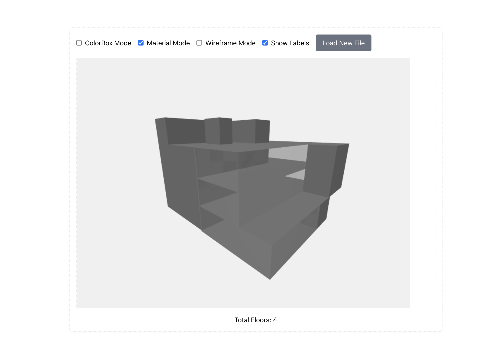

# 3D Architectural Viewer

A React-based 3D architectural viewer using Three.js to visualize building structures from JSON data files. This project allows users to upload JSON files containing building data and visualize the structure in various modes.

<p align="center">
    
    
    
</p>

## Features
- **3D Visualization**: Render 3D models of buildings with different visualization modes.
- **Interactive Controls**: Orbit controls for navigating the 3D scene.
- **Hover Effects**: Highlight rooms on hover with detailed information.
- **Dynamic Loading**: Upload JSON files to dynamically load and visualize building data.
- **Multiple Modes**: Toggle between ColorBox, Material, and Wireframe modes.
- **Labels**: Display labels with room information.

## Installation

### Clone the repository:
```sh
git https://github.com/kuock0129/3D-Archi-Viewer.git
cd 3D-Archi-Viewer
```

### Install dependencies:
```sh
npm install
```

### Start the development server:
```sh
npm run dev
```

### Open the browser
```sh
http://localhost:3000 
```

## Usage
1. Open the application in your browser.
2. Upload a JSON file containing building data.
3. Use the checkboxes to toggle between different visualization modes and labels.
4. Hover over rooms to see detailed information.

## JSON File Format
The JSON file should contain an array of floors, each with an array of rooms. Each room should have a shape defined by coordinates, a type, an ID, and a name. The example is in the `example/` folder.

Example:

```json
{
  "floors": [
    {
      "id": 1,
      "rooms": [
        {
          "id": "101",
          "name": "Living Room",
          "type": "residential",
          "shape": [
            { "x": 0, "y": 0 },
            { "x": 5, "y": 0 },
            { "x": 5, "y": 5 },
            { "x": 0, "y": 5 }
          ]
        }
      ]
    }
  ]
}
```

## Project Structure
- `BuildingViewer.tsx`: Main component for the 3D viewer.
- `src/components/types.ts`: Type definitions for building data.
- `src/components/mode/`: Contains modules for different visualization modes.
- `src/components/effect/`: Contains modules for hover effects.
- `src/components/build_config.ts`: Configuration constants for the viewer.

## Dependencies
- **React**: JavaScript library for building user interfaces.
- **Three.js**: JavaScript 3D library for rendering 3D graphics.
- **OrbitControls**: Three.js module for camera controls.
- **CSS2DRenderer**: Three.js module for rendering 2D elements in 3D space.
- **Tailwind CSS**: Utility-first CSS framework for styling.

## License
This project is licensed under the MIT License. See the `LICENSE` file for details.

## Acknowledgements
- [Three.js](https://threejs.org/)
- [React](https://react.dev/)
- [Tailwind CSS](https://tailwindcss.com/)
